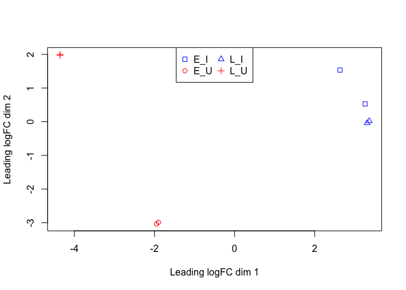
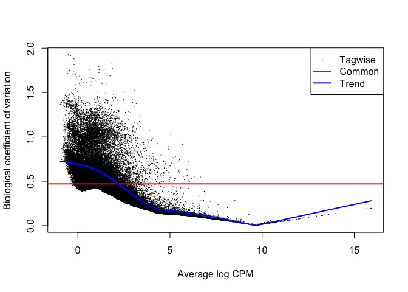
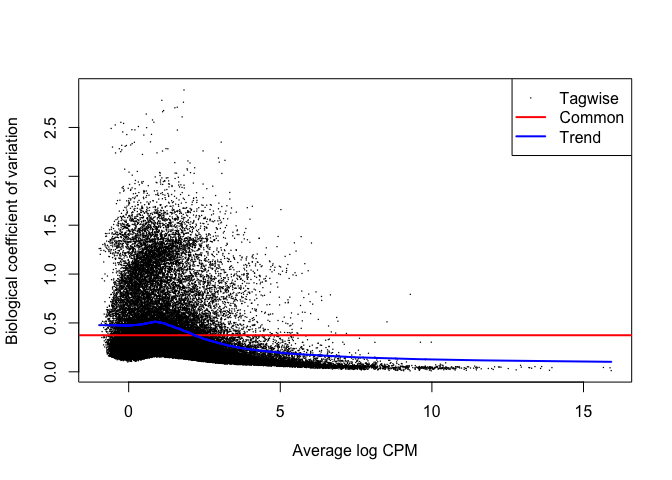
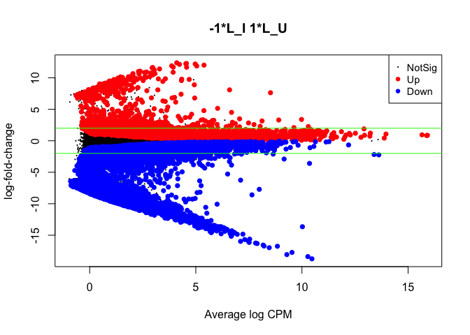
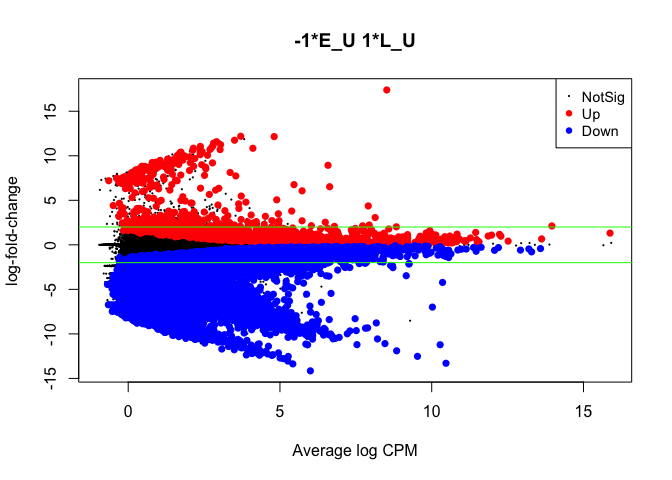
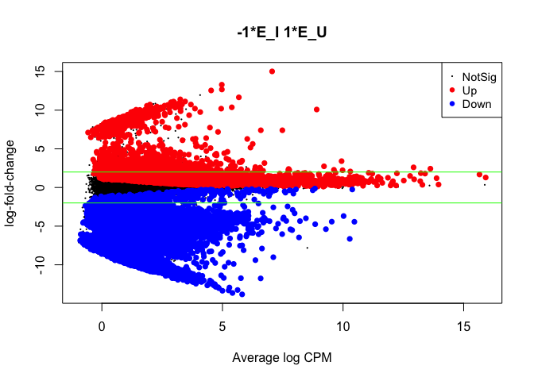
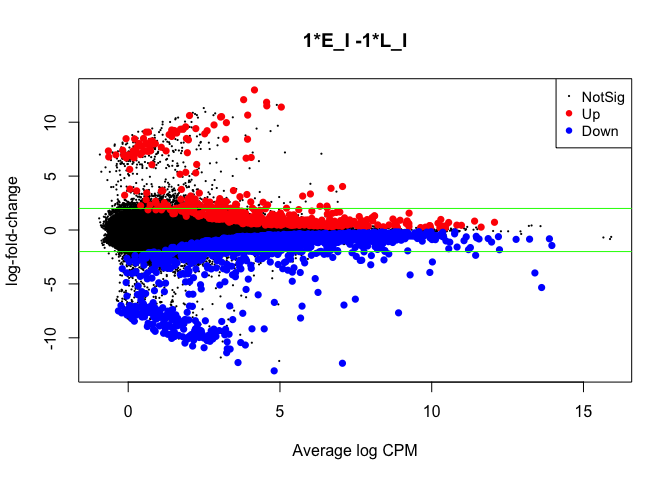

crab-edgeR-test
================

Rmd to test `edgeR` on 2019 crab RNAseq data.

``` r
library(edgeR)
```

    ## Loading required package: limma

Files needed: 1. “targets\_2019.txt” that contains treatment and sample
information 2. “raw data” that is comprised of annotated BLAST output
with gene IDs and counts (file made by Sam/Steven)

“targets\_2019.txt” file was created based on manual for edgeR, what was
done for EIMD 2019, and the data available in the 2019 crab seq. dataset
number of columns needs to be same as number count columns in
rawdata\_2019 Note: “L” = Day 26, stands for ‘later’ “E” = Day 12,
stands for ‘earlier’ “U” = uninfected “I” = infected I don’t think using
12 and 26 works for R upload file:

``` r
targets_2019 <- readTargets("../analyses/targets_2019.txt")
targets_2019
```

    ##   sample Day_InfectionStatus
    ## 1      1                 L_U
    ## 2      2                 L_U
    ## 3      3                 E_U
    ## 4      4                 E_U
    ## 5      5                 E_I
    ## 6      6                 E_I
    ## 7      7                 L_I
    ## 8      8                 L_I

set groups equal to the different samples

``` r
group_2019 <- targets_2019$Day_InfectionStatus
group_2019 <- as.factor(group_2019)
group_2019
```

    ## [1] L_U L_U E_U E_U E_I E_I L_I L_I
    ## Levels: E_I E_U L_I L_U

import raw count
data

``` r
rawdata_2019 <- read.delim("https://raw.githubusercontent.com/sr320/nb-2019/master/C_bairdi/analyses/Abundance-merge.txt", header = TRUE)
head(rawdata_2019)
```

    ##                  target_id X329777_L2 X329777_L1 X329775_L2 X329775_L1
    ## 1 TRINITY_DN21442_c0_g1_i2          0          0          0          0
    ## 2 TRINITY_DN21442_c0_g1_i1          3          3          6          4
    ## 3 TRINITY_DN21452_c0_g1_i1          0          0          0          0
    ## 4 TRINITY_DN21452_c0_g2_i1          0          0          0          0
    ## 5 TRINITY_DN21478_c0_g1_i1          3          2          2          2
    ## 6 TRINITY_DN21477_c1_g1_i2          0          0          5          0
    ##   X329774_L2 X329774_L1 X329776_L2 X329776_L1
    ## 1          0          0          0          0
    ## 2          3          2          4          4
    ## 3          1         12         11          9
    ## 4         18         87         69         81
    ## 5          0          8          1          3
    ## 6          0          2          0          0

Make list of differentially expressed genes (DGE)

``` r
y_2019 <- DGEList(counts = rawdata_2019[,2:9], group = group_2019)
head(y_2019$counts)
```

    ##   X329777_L2 X329777_L1 X329775_L2 X329775_L1 X329774_L2 X329774_L1 X329776_L2
    ## 1          0          0          0          0          0          0          0
    ## 2          3          3          6          4          3          2          4
    ## 3          0          0          0          0          1         12         11
    ## 4          0          0          0          0         18         87         69
    ## 5          3          2          2          2          0          8          1
    ## 6          0          0          5          0          0          2          0
    ##   X329776_L1
    ## 1          0
    ## 2          4
    ## 3          9
    ## 4         81
    ## 5          3
    ## 6          0

filtering out lowly expressed genes; from EIMD: “since the smallest
group size is four, we keeping genes with at least one count per million
in at least four samples” I need to figure out how much I should filter
out, but for now am trying same filtering that was done with EIMD
nonzostera genes

``` r
keep_2019 <- rowSums(cpm(y_2019)>1) >= 3
y_2019 <- y_2019[keep_2019,]
dim(y_2019) 
```

    ## [1] 56039     8

Keeping 56,039 genes in 8 libraries

recompute the library sizes: (this didn’t work in nonZostera R, and
isn’t working here. i think it’s because there are two $ in the first
phrase)

``` r
y_2019$samples$lib.size <- colSums(y_2019$counts)
```

# Calculating normalization factors

``` r
y_2019 <- calcNormFactors(y_2019)
y_2019$samples 
```

    ##            group lib.size norm.factors
    ## X329777_L2   L_U 15358901    0.9059032
    ## X329777_L1   L_U 16819864    0.8962543
    ## X329775_L2   E_U 14244903    0.9511170
    ## X329775_L1   E_U 15807526    0.9367774
    ## X329774_L2   E_I  3126647    1.2564024
    ## X329774_L1   E_I 18989736    1.1751383
    ## X329776_L2   L_I 16786446    0.9679599
    ## X329776_L1   L_I 18699386    0.9672562

From section 2.7 in manual: “a normalization factor below 1 indicates
that a small number of high count genes are monopolizing the sequencing,
causing the counts for other genes to be lower than would be usual given
the library size. As a result, the library size will be scaled down,
analogous to scaling the counts upwards in that library. Conversely, a
factor above 1 scales up the library size, analogous to downscaling the
counts” These numbers are pretty similar to those from EIMD.. not too
high above 1, not too low below 1… and those were deemed “good”

store lib.size in vector called “n” … not sure why at the moment…

``` r
n <- y_2019$samples$lib.size
```

# Examining sample for outliers

Section 4.1.5 in manual “Data exploration” Used same code as from EIMD…
not sure if it works for crabs - will explore more

``` r
points <- c(0,1,2,3)
colors <- (rep(c("blue","red"),2))
plotMDS(y_2019, col=colors[group_2019], pch=points[group_2019])  
legend ("top", legend=levels(group_2019), pch=points, col=colors, ncol=2)
```

<!-- -->
Section 3.2.3 of manual: “GLM Approach”

``` r
design <-model.matrix(~0+group_2019)
colnames(design) <- levels(group_2019)
design
```

    ##   E_I E_U L_I L_U
    ## 1   0   0   0   1
    ## 2   0   0   0   1
    ## 3   0   1   0   0
    ## 4   0   1   0   0
    ## 5   1   0   0   0
    ## 6   1   0   0   0
    ## 7   0   0   1   0
    ## 8   0   0   1   0
    ## attr(,"assign")
    ## [1] 1 1 1 1
    ## attr(,"contrasts")
    ## attr(,"contrasts")$group_2019
    ## [1] "contr.treatment"

Section 2.10 of manual: "More complex experiemnts (glm functionality)

``` r
y_2019 <- estimateGLMCommonDisp(y_2019, design, verbose=TRUE)
```

    ## Disp = 0.22139 , BCV = 0.4705

``` r
y_2019 <- estimateGLMTrendedDisp(y_2019,design)
y_2019 <- estimateGLMTagwiseDisp(y_2019,design)
plotBCV(y_2019)
```

<!-- -->
Section 3.2.5 of manual: “A more traditional glm approach”

``` r
fit <- glmQLFit(y_2019, design)
design
```

    ##   E_I E_U L_I L_U
    ## 1   0   0   0   1
    ## 2   0   0   0   1
    ## 3   0   1   0   0
    ## 4   0   1   0   0
    ## 5   1   0   0   0
    ## 6   1   0   0   0
    ## 7   0   0   1   0
    ## 8   0   0   1   0
    ## attr(,"assign")
    ## [1] 1 1 1 1
    ## attr(,"contrasts")
    ## attr(,"contrasts")$group_2019
    ## [1] "contr.treatment"

``` r
colnames(fit)
```

    ## [1] "E_I" "E_U" "L_I" "L_U"

Estimating dispersion (pg 55 of manual) Section 4.2.7 “Estimating the
dispersion”

``` r
y_2019 <- estimateDisp(y_2019, design, robust=TRUE)
```

``` r
y_2019$common.dispersion
```

    ## [1] 0.1399804

Value of common dispersion = 0.1399804. Dispersion is “estimating the
genewise dispersion over all genes, allowing for possible abundance
trend. The estimation is also robustified against potential outlier
genes.”

``` r
plotBCV(y_2019)
```

<!-- -->
BCV = coefficient of biological variation - is the square root of
dispersion Therefore, the BCV = 0.37419546 Trended dispersion (blue)
“shows a decreasing trend with expression level”

# Defining contrast groupings

Section 3.3.1 “Defining each treatment combination as a group”
Contrasts: What genes are DE in crabs exposed to Hamtodinium
vs. controls? The data file “targets\_2019.txt” outlines the treatment
conditions applied to each sample.

``` r
targets_2019
```

    ##   sample Day_InfectionStatus
    ## 1      1                 L_U
    ## 2      2                 L_U
    ## 3      3                 E_U
    ## 4      4                 E_U
    ## 5      5                 E_I
    ## 6      6                 E_I
    ## 7      7                 L_I
    ## 8      8                 L_I

Make the different contrast options: Day 26 –\> “L” for later Day 12 –\>
“E” for earlier “U” –\> uninfected “I” –\> Infected

``` r
my.contrasts <-makeContrasts(
  LU.LI=L_U-L_I, LU.EU=L_U-E_U, EU.EI=E_U-E_I, EI.LI=E_I-L_I, levels=design)
```

``` r
qlf.LU.LI <- glmQLFTest(fit, contrast=my.contrasts[,"LU.LI"])
topTags(qlf.LU.LI)
```

    ## Coefficient:  -1*L_I 1*L_U 
    ##             logFC    logCPM         F       PValue          FDR
    ## 89588  -13.650100 10.022538 33661.348 2.348968e-12 1.316338e-07
    ## 130461  -8.592319  7.645541 13777.821 3.313789e-11 9.285070e-07
    ## 130457  -7.712603  7.991139 11856.292 5.170913e-11 9.659093e-07
    ## 120117 -16.978804  8.459053 36161.938 1.023736e-10 9.735931e-07
    ## 101310 -17.733327  9.531055 34639.021 1.138198e-10 9.735931e-07
    ## 112102   1.063198  9.938529  8905.212 1.207177e-10 9.735931e-07
    ## 89289  -18.749816 10.469539 33719.973 1.216144e-10 9.735931e-07
    ## 2733   -16.245988  7.817375 21851.027 3.540736e-10 2.125214e-06
    ## 128560   1.582287  9.589699  6164.262 3.588502e-10 2.125214e-06
    ## 92240    1.214942  9.918232  6050.291 3.792384e-10 2.125214e-06

``` r
qlf.LU.EU <- glmQLFTest(fit, contrast=my.contrasts[,"LU.EU"])
topTags(qlf.LU.EU)
```

    ## Coefficient:  -1*E_U 1*L_U 
    ##             logFC    logCPM         F       PValue          FDR
    ## 112102  1.5920715  9.938529 18204.727 1.451562e-11 8.134406e-07
    ## 120291 -2.1594750  9.250499 12687.401 4.230616e-11 1.185398e-06
    ## 94679  -0.8314528  9.978244  5071.796 6.393739e-10 1.090610e-05
    ## 73122  -2.3100478  8.644459  4745.552 7.784649e-10 1.090610e-05
    ## 3074   -2.3280009  8.704876  3161.443 2.590121e-09 2.528313e-05
    ## 64152  -1.3114640  8.958498  3028.645 2.940766e-09 2.528313e-05
    ## 125396 -4.2209278 10.357042  2956.497 3.158192e-09 2.528313e-05
    ## 34585  -1.9321510  8.401625  2824.046 3.616809e-09 2.533530e-05
    ## 3367    1.3288451  9.816641  2602.392 4.606065e-09 2.698175e-05
    ## 95253   6.5255397  6.637421  2387.307 5.944698e-09 2.698175e-05

``` r
qlf.EU.EI <- glmQLFTest(fit, contrast=my.contrasts[,"EU.EI"])
topTags(qlf.EU.EI)
```

    ## Coefficient:  -1*E_I 1*E_U 
    ##            logFC    logCPM         F       PValue          FDR
    ## 112102  3.408702  9.938529 31625.085 2.826035e-12 1.583682e-07
    ## 138912  1.441195  9.282670 15140.213 2.506135e-11 7.022064e-07
    ## 94679   1.067401  9.978244  7377.052 2.108261e-10 3.430278e-06
    ## 89588  -3.693839 10.022538  6559.995 2.984658e-10 3.430278e-06
    ## 34403   1.565253  9.009038  6504.558 3.060617e-10 3.430278e-06
    ## 130461 -4.322616  7.645541  4755.426 7.736892e-10 6.990672e-06
    ## 101310 -4.422608  9.531055 14754.504 9.314409e-10 6.990672e-06
    ## 89289  -4.434518 10.469539 13295.186 1.203791e-09 6.990672e-06
    ## 95334   1.891385  9.688340  4026.291 1.266296e-09 6.990672e-06
    ## 56647   1.655179  9.449077  3903.621 1.387735e-09 6.990672e-06

``` r
qlf.EI.LI <- glmQLFTest(fit, contrast=my.contrasts[,"EI.LI"])
topTags(qlf.EI.LI)
```

    ## Coefficient:  1*E_I -1*L_I 
    ##            logFC    logCPM         F       PValue          FDR
    ## 112102 -3.937575  9.938529 45518.871 9.605473e-13 5.382811e-08
    ## 89588  -2.963632 10.022538  9711.629 9.338126e-11 2.616496e-06
    ## 130460 -1.737039 10.561350  3842.524 1.454063e-09 2.358909e-05
    ## 130457 -3.226264  7.991139  3656.737 1.683762e-09 2.358909e-05
    ## 130461 -2.823767  7.645541  3121.763 2.688747e-09 3.013494e-05
    ## 138912 -0.562110  9.282670  2206.679 7.501800e-09 7.006556e-05
    ## 70921  -2.800543  7.694074  2060.439 9.187681e-09 7.355264e-05
    ## 70917  -2.773858  8.427413  1919.301 1.133175e-08 7.644159e-05
    ## 76634  -2.373908  8.011280  1814.251 1.338271e-08 7.644159e-05
    ## 35274  -2.222262  8.584965  1802.562 1.364078e-08 7.644159e-05

``` r
summary(decideTests(qlf.LU.LI))
```

    ##        -1*L_I 1*L_U
    ## Down          35212
    ## NotSig        16093
    ## Up             4734

``` r
#Down          35212
#NotSig        16093
#Up             4734
summary(decideTests(qlf.LU.EU))
```

    ##        -1*E_U 1*L_U
    ## Down          14418
    ## NotSig        40006
    ## Up             1615

``` r
#Down          14418
#NotSig        40006
#Up             1615
summary(decideTests(qlf.EU.EI))
```

    ##        -1*E_I 1*E_U
    ## Down          26340
    ## NotSig        20440
    ## Up             9259

``` r
#Down          26340
#NotSig        20440
#Up             9259
summary(decideTests(qlf.EI.LI))
```

    ##        1*E_I -1*L_I
    ## Down           1721
    ## NotSig        53813
    ## Up              505

``` r
#Down           1721
#NotSig        53813
#Up              505

plotMD(qlf.LU.LI)
abline(h=c(-2,2), col="green")
```

<!-- -->

``` r
plotMD(qlf.LU.EU)
abline(h=c(-2,2), col="green")
```

<!-- -->

``` r
plotMD(qlf.EU.EI)
abline(h=c(-2,2), col="green")
```

<!-- -->

``` r
plotMD(qlf.EI.LI)
abline(h=c(-2,2), col="green")
```

<!-- -->
